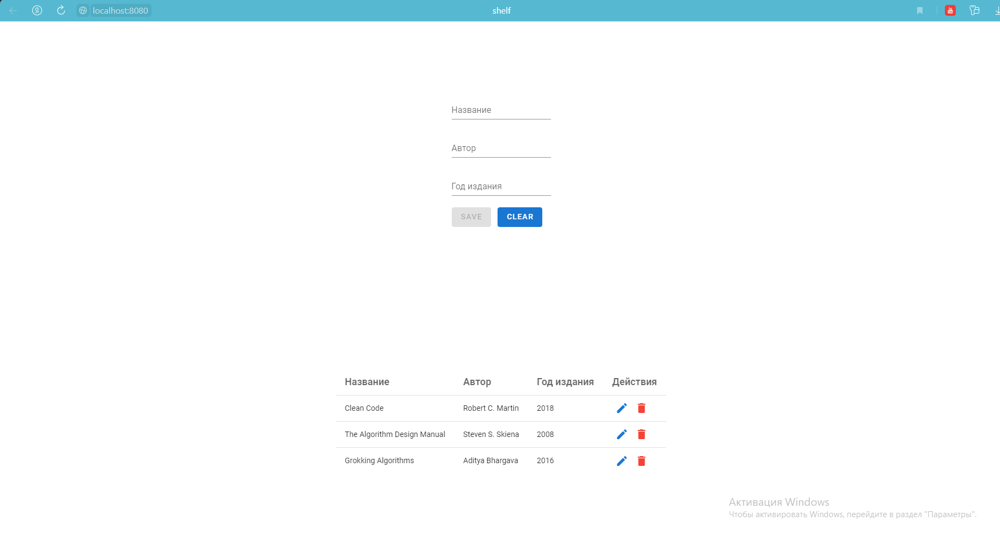

# Shelf app 
Django + DRF + Vuejs project.

Simple CRUD app for books

# Run app with docker compose 
Start and build containers with the command:
  - `docker-compose up --build`

Create Django tables on DB:
  - `docker-compose run backend migrate`

Start all containers:
  - `docker-compose up`

